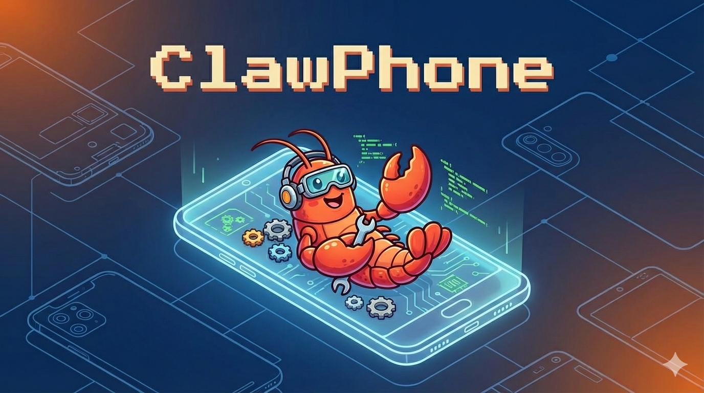

<p align="center"></p>

# ClawPhone : Run OpenClaw on Android

Install and run [OpenClaw](https://openclaw.ai) on an Android device using Termux. No root required. The intended workflow is to **access the phone remotely (SSH or Tailscale)** and run the install from your computer with a proper keyboard.

## Prerequisites

- **Termux** from [F-Droid](https://f-droid.org/en/packages/com.termux/) (do not use the Play Store version).
- **Termux:API** from [F-Droid](https://f-droid.org/en/packages/com.termux.api/) for hardware features (notifications, battery, clipboard).

See [docs/prerequisites.md](docs/prerequisites.md) for details and optional apps.

## Quick start

### 1. Get a shell on the phone from your computer

On the phone (in Termux), do the minimal setup once: install OpenSSH, start `sshd`, set a password, and note the SSH command. Then from your computer, connect with SSH (or use [Tailscale](docs/remote-access.md#option-b-tailscale) so you don’t need to be on the same Wi‑Fi).

Full steps: [Remote access (SSH or Tailscale)](docs/remote-access.md).

Example from your computer after SSH is set up:

```bash
ssh -p 8022 <termux_user>@<phone_ip>
```

### 2. Copy this repo to the phone and run setup

From your **computer** (in a new terminal, not inside the SSH session), copy the PhoneClaw setup to the phone. Replace `<termux_user>`, `<phone_ip>`, and the path to this repo:

```bash
scp -r -P 8022 /path/to/PhoneClaw <termux_user>@<phone_ip>:~/phoneclaw-setup
```

Then in your **SSH session to the phone**:

```bash
cd ~/phoneclaw-setup
chmod +x setup_claw.sh update_claw.sh scripts/*.sh
./setup_claw.sh
```

### 3. Onboard and start (still in the SSH session)

When setup finishes:

```bash
openclaw onboard
```

When asked to install a daemon/system service, choose **No**.

Then:

```bash
source ~/.bashrc
./scripts/start_claw.sh
termux-wake-lock
```

### 4. Use the UI

- On the phone: **http://localhost:18789**
- From another device on the same network: **http://\<phone-ip\>:18789** (if you set `gateway.bind` to `lan`; see [optional features](docs/optional-features.md)).

## Scripts

| Script | Purpose |
|--------|--------|
| `setup_claw.sh` | One-time install: dependencies, OpenClaw, path patches, optional service definition. |
| `scripts/start_claw.sh` | Start the gateway (tmux by default; use `--mode service` for runit). |
| `scripts/stop_claw.sh` | Stop the gateway (tmux or service). |
| `scripts/status_claw.sh` | Show runtime mode and status. |
| `scripts/doctor_claw.sh` | Check environment, patch status, and readiness. |
| `update_claw.sh` | Update OpenClaw and re-apply patches; restarts current mode. |

## Managing OpenClaw

- **Status:** `./scripts/status_claw.sh` or `sv status openclaw` (if using service mode).
- **Stop:** `./scripts/stop_claw.sh` or `sv down openclaw`.
- **Start:** `./scripts/start_claw.sh` or `sv up openclaw`.
- **Logs (service mode):** `tail -f $PREFIX/var/log/openclaw/current`.

## Docs

- [Prerequisites](docs/prerequisites.md)
- [Remote access (SSH or Tailscale)](docs/remote-access.md)
- [Troubleshooting](docs/troubleshooting.md)
- [Optional features](docs/optional-features.md) (LAN bind, Termux:GUI, reboot)
- [Advanced: Service mode (runit)](docs/advanced-service-mode.md)

## Credits

[OpenClaw](https://openclaw.ai) by Clawdy.
