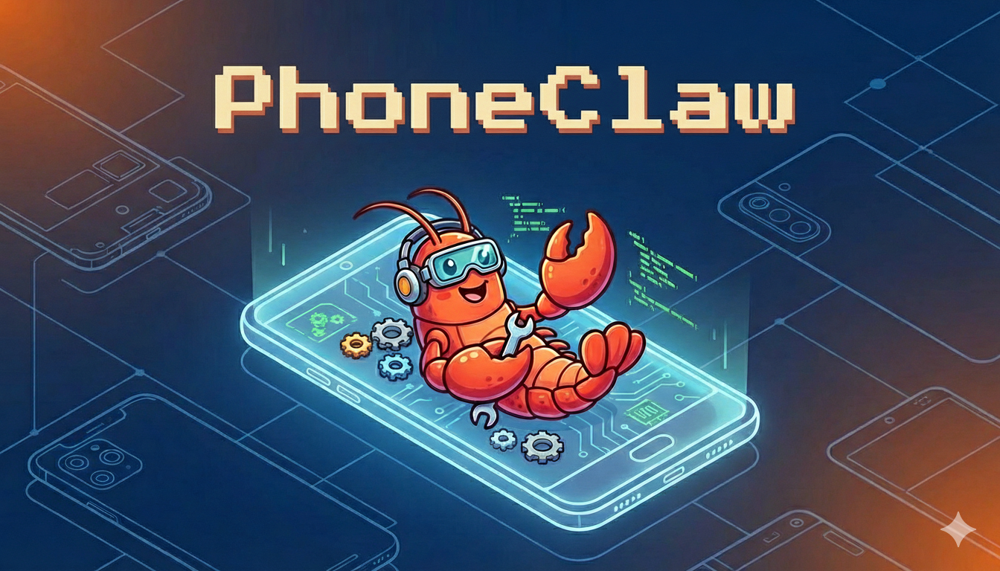

# PhoneClaw: Complete Step-by-Step Guide

This guide walks you through the entire process of running OpenClaw on an Android phone, from scratch. No prior setup is assumed — just an Android phone in your hand and a computer nearby.

---

## Phase 1: Prepare the Phone

### Step 1: Install F-Droid (app store)

F-Droid is an open-source app store. You need it because the Google Play versions of Termux are outdated and will not work.

1. On the phone, open a browser (Chrome, Firefox, etc.).
2. Go to **https://f-droid.org**.
3. Tap **Download F-Droid**.
4. When the APK downloads, open it. Android will ask you to allow installs from this source — allow it.
5. Install F-Droid and open it.
6. Wait for F-Droid to update its repository index (this takes a minute on first launch).

### Step 2: Install Termux

Termux is a Linux terminal environment for Android. It gives you a full shell, package manager, and the ability to run Node.js, Python, and other tools — no root required.

1. In F-Droid, search for **Termux**.
2. Install **Termux** (by Fredrik Fornwall). Make sure it is the F-Droid version, not the Play Store one.
3. Open Termux. You will see a terminal with a `$` prompt. This means it is working.

### Step 3: Install Termux:API

Termux:API lets Termux interact with Android hardware — notifications, battery status, clipboard, Wi-Fi info, and more. OpenClaw uses these features.

1. Go back to F-Droid.
2. Search for **Termux:API**.
3. Install **Termux:API** (by Fredrik Fornwall).
4. Open Termux:API once so Android registers the app.

### Step 4: Grant permissions

1. Go to Android **Settings > Apps > Termux** and grant any requested permissions.
2. Do the same for **Termux:API**.
3. While you are in Termux's app settings, tap **Battery** and set it to **Unrestricted** (or disable battery optimization). This prevents Android from killing OpenClaw when the screen is off.

### Step 5: Make sure you have Wi-Fi

Both the phone and your computer need to be on the same Wi-Fi network (unless you use Tailscale — see the alternative in Phase 2). The initial install also downloads several hundred MB of packages, so a reliable connection matters.

---

## Phase 2: Set Up Remote Access (SSH)

You will run the entire install from your computer over SSH. This is much easier than typing long commands on the phone's touch keyboard.

### Step 6: Install OpenSSH on the phone

On the phone, in Termux, type these commands:

```bash
pkg update && pkg upgrade -y
pkg install -y openssh
```

### Step 7: Start the SSH server

```bash
sshd
```

Termux's SSH server listens on **port 8022** (not the standard port 22).

### Step 8: Set a password

```bash
passwd
```

Type a password and confirm it. You will use this to log in from your computer.

### Step 9: Find your username and IP address

Run this to display the SSH command you will use from your computer:

```bash
termux-wifi-connectioninfo
```

This prints your Wi-Fi connection details, including the phone's IP address (e.g. `192.168.1.42`).

Also note your Termux username:

```bash
whoami
```

It will be something like `u0_a123`.

### Step 10: Connect from your computer

On your computer, open a terminal and run:

```bash
ssh -p 8022 u0_a123@192.168.1.42
```

Replace `u0_a123` with your Termux username from `whoami`, and `192.168.1.42` with the IP from `termux-wifi-connectioninfo`.

Enter the password you set in Step 8. You are now inside Termux on the phone, but typing from your computer's keyboard.

> **Tip — SSH keys (optional but recommended):** On your computer, run:
>
> ```bash
> ssh-keygen -t ed25519
> ssh-copy-id -p 8022 u0_a123@192.168.1.42
> ```
>
> After this, you can log in without typing the password every time.

### Alternative: Tailscale (skip Steps 6-10 if you prefer this)

If your phone and computer are not on the same Wi-Fi, or you want a more permanent connection, use Tailscale:

1. Install the **Tailscale** app on the phone (Play Store or F-Droid) and log in.

2. Install Tailscale on your computer and log in with the same account.

3. In Termux on the phone, still install OpenSSH and start `sshd` (Steps 6-8 above).

4. Find the phone's Tailscale IP in the Tailscale admin console or app.

5. From your computer:

   ```bash
   ssh -p 8022 u0_a123@100.x.y.z
   ```

   (Use the phone's Tailscale IP or MagicDNS name like `myphone.tail12345.ts.net`.)

---

## Phase 3: Install OpenClaw

Everything from here is done **in the SSH session** on your computer (connected to the phone).

### Step 11: Install git and clone this repository

```bash
pkg install -y git
git clone https://github.com/tjansn/PhoneClaw ~/phoneclaw-setup
cd ~/phoneclaw-setup
```

### Step 12: Make scripts executable

```bash
chmod +x setup_claw.sh update_claw.sh scripts/*.sh
```

### Step 13: Run the setup script

```bash
./setup_claw.sh
```

This script does the following automatically:

1. Updates Termux packages and installs dependencies (Node.js, Python, build tools, tmux, etc.).
2. Configures environment variables (`TMPDIR`, `TMP`, `TEMP`) so OpenClaw uses Termux-compatible paths.
3. Applies a Node-GYP workaround for Android.
4. Installs OpenClaw globally via npm.
5. Patches hardcoded `/tmp/openclaw` paths in the installed package to use Termux's `$PREFIX/tmp/openclaw`.
6. Creates a runit service definition (optional, not started).

**This will take a while.** The npm install includes native code (llama.cpp) that must be compiled on the phone. Expect **15-30 minutes** on first install. Do not interrupt it.

When the script finishes, you will see a "SETUP COMPLETE" message with next steps.

---

## Phase 4: Onboard and Start

### Step 14: Run onboarding

```bash
openclaw onboard
```

This walks you through the initial OpenClaw configuration (API keys, preferences, etc.).

**Important:** When asked whether to install a **daemon** or **system service**, choose **No**. Android does not have systemd. The PhoneClaw scripts handle the service themselves.

### Step 15: Reload your shell environment

```bash
source ~/.bashrc
```

This loads the environment variables that the setup script added.

### Step 16: Start the OpenClaw gateway

```bash
./scripts/start_claw.sh
```

This starts OpenClaw in a **tmux** session (a background terminal session that keeps running even if you disconnect from SSH).

### Step 17: Prevent Android from killing the process

```bash
termux-wake-lock
```

This acquires a wake lock so Android does not put Termux to sleep and kill the gateway.

### Step 18: Verify it is running

```bash
./scripts/status_claw.sh
```

You should see output indicating tmux mode is active and the UI is at `http://localhost:18789`.

For a more thorough environment check:

```bash
./scripts/doctor_claw.sh
```

This checks all dependencies, paths, patches, and runtime status. Fix any FAIL items it reports.

---

## Phase 5: Access the Dashboard

### Get Your Dashboard URL with Token

The easiest way to access the dashboard is to use the built-in command that includes your authentication token:

```bash
openclaw dashboard
```

This will display a URL with your token embedded, like:
```
http://localhost:18789/#token=YOUR_TOKEN_HERE
```

**Important:** You must use the full URL including the `#token=...` part for authentication to work.

### Option A: On the phone itself

1. In Termux, run `openclaw dashboard`
2. Copy the URL (the one with `#token=...`)
3. Open a browser on the phone and paste the full URL

### Option B: From your computer (recommended)

Keep the gateway bound to localhost for security and forward the port over SSH:

1. On your computer, open a **new** terminal and run:
   ```bash
   ssh -L 18789:127.0.0.1:18789 -p 8022 u0_a123@192.168.1.42
   ```
   Replace the username and IP with yours from earlier steps.

2. In the SSH session on the phone, run:
   ```bash
   openclaw dashboard
   ```

3. Copy the URL with the token and open it in your computer's browser

The dashboard should now connect successfully! Everything running on the phone is accessible from your computer's browser.

### Troubleshooting Dashboard Access

If you see "disconnected (1008): unauthorized: gateway token missing":

- Make sure you're using the **full URL** including the `#token=...` part
- Get a fresh URL by running `openclaw dashboard` again
- The token is stored in `~/.openclaw/openclaw.json` under `gateway.auth.token` if you need to access it manually

---

## Day-to-Day Usage

### Starting OpenClaw

SSH into the phone, navigate to the repo, and run:

```bash
cd ~/phoneclaw-setup
./scripts/start_claw.sh
termux-wake-lock
```

### Stopping OpenClaw

```bash
./scripts/stop_claw.sh
```

### Checking status

```bash
./scripts/status_claw.sh
```

### Viewing live output

The gateway runs in a tmux session called `openclaw`. To attach and see its output:

```bash
tmux attach -t openclaw
```

To detach without stopping it: press `Ctrl+b`, then `d`.

### Updating OpenClaw

When a new version is released:

```bash
cd ~/phoneclaw-setup
./update_claw.sh
```

This detects whether the gateway is running (tmux or service), stops it, updates the npm package, re-applies the Termux path patches, and restarts in the same mode.

---

## Troubleshooting

### Install takes a very long time or fails

- The first install compiles native code (llama.cpp). **15-30 minutes is normal.** Do not interrupt it.
- If `npm install` fails, check the error for a missing system package and install it: `pkg install -y <package>`, then re-run `./setup_claw.sh`.
- If setup reports an `ncurses` / `ncurses-ui-libs` version mismatch, your Termux mirror is stale. Run:

```bash
termux-change-repo
pkg update -y && pkg upgrade -y
./setup_claw.sh
```

### Errors about `/tmp/openclaw` or "permission denied"

OpenClaw hardcodes `/tmp/openclaw`, which does not work on Termux. The setup script patches this, but if you see the error after a manual install or update:

```bash
cd ~/phoneclaw-setup
./scripts/fix_paths.sh
```

This dedicated script will:
- Remove any duplicate prefix issues
- Patch all remaining `/tmp/openclaw` references
- Verify the temp directory is set up correctly

Alternatively, you can run:

```bash
./update_claw.sh
```

Or manually ensure the directory and environment:

```bash
mkdir -p $PREFIX/tmp/openclaw
source ~/.bashrc
```

**Note:** The doctor script may report files with `/tmp/openclaw` references even when correctly patched. As long as the gateway is running and writing logs to `$PREFIX/tmp/openclaw/`, the patches are working correctly. The detection matches `/tmp/openclaw` as a substring within the corrected path.

### "No systemd" or daemon errors

Expected on Android — there is no systemd. Use tmux mode (the default) or runit service mode. Never choose to install a daemon during `openclaw onboard`.

### Dashboard shows "unauthorized: gateway token missing"

This means you're accessing the dashboard without the authentication token. **Solution:**

1. Run `openclaw dashboard` in Termux to get the full URL with token
2. Copy the **entire URL** including the `#token=...` part
3. Open that full URL in your browser

The token must be in the URL as `http://localhost:18789/#token=YOUR_TOKEN_HERE`. Just opening `http://localhost:18789` without the token will fail.

**Alternative:** If you have developer tools in your browser, you can manually set the token in localStorage:
```javascript
localStorage.setItem('openclaw-gateway-token', 'YOUR_TOKEN_HERE')
```
Then refresh the page. (Note: Mobile browsers typically don't have console access)

### Gateway stops when the phone screen turns off

Run `termux-wake-lock` before starting the gateway. Also make sure battery optimization is disabled for Termux in Android settings (Step 4).

### Run the doctor

```bash
./scripts/doctor_claw.sh
```

This checks everything and tells you exactly what to fix.

---

## Advanced: Service Mode (runit)

Instead of running in a tmux session, you can run OpenClaw as a managed background service using termux-services (runit). This is optional.

### Start in service mode

```bash
./scripts/start_claw.sh --mode service
termux-wake-lock
```

### Manage the service

```bash
sv status openclaw    # Check status
sv up openclaw        # Start
sv down openclaw      # Stop
```

### View logs

```bash
tail -f $PREFIX/var/log/openclaw/current
```

### Switch back to tmux mode

```bash
sv down openclaw
./scripts/start_claw.sh
```

---

## Optional Extras

### Termux:GUI

For overlay and extra hardware integration:

1. Install **Termux:GUI** from F-Droid.
2. In Termux: `pkg install -y termux-gui`.
3. Grant the permissions it requests.

### Reboot persistence (Termux:Boot)

OpenClaw does not start automatically after a phone reboot. If you want that, install **Termux:Boot** from F-Droid and configure it yourself. This is outside the scope of this guide — see the Termux:Boot documentation.

---

## Quick Reference

| What                         | Command                                                      |
| ---------------------------- | ------------------------------------------------------------ |
| Start gateway (tmux)         | `./scripts/start_claw.sh`                                    |
| Start gateway (service)      | `./scripts/start_claw.sh --mode service`                     |
| Stop gateway                 | `./scripts/stop_claw.sh`                                     |
| Check status                 | `./scripts/status_claw.sh`                                   |
| Health check                 | `./scripts/doctor_claw.sh`                                   |
| Fix path issues              | `./scripts/fix_paths.sh`                                     |
| Update OpenClaw              | `./update_claw.sh`                                           |
| Get dashboard URL with token | `openclaw dashboard`                                         |
| View tmux session            | `tmux attach -t openclaw`                                    |
| Detach from tmux             | `Ctrl+b`, then `d`                                           |
| Keep alive in background     | `termux-wake-lock`                                           |
| Dashboard URL format         | `http://localhost:18789/#token=YOUR_TOKEN`                   |
| Dashboard (computer via SSH) | `ssh -L 18789:127.0.0.1:18789 -p 8022 user@ip` then open dashboard URL |
